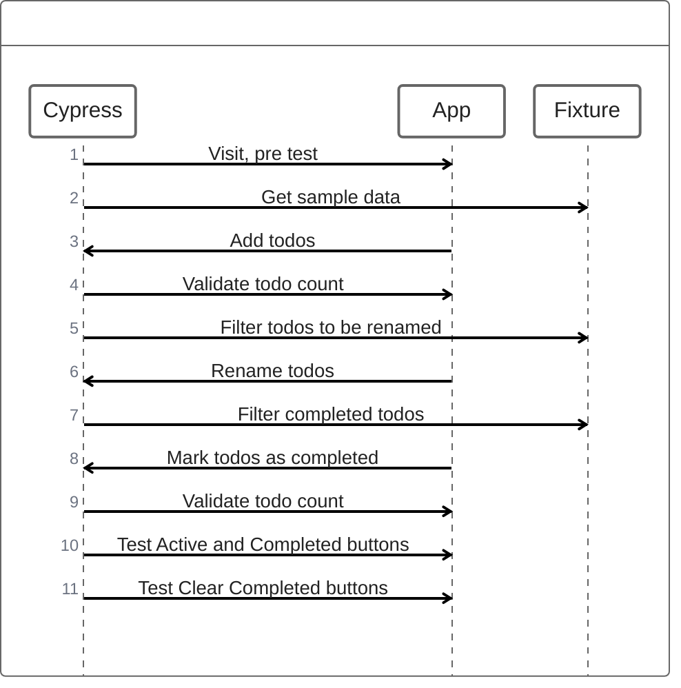

# Test Setup for Vite + React app

## Getting Started
To run the vite app in developement mode, run the following commands:
```sh
    pnpm install --save-dev
    pnpm dev
```
This will run the app at http://localhost:5173/ 


## Testing

This project has [Cypress](https://www.cypress.io/) setup for E2E and Component testing.

### E2E testing

Tests all features in a single run using sample data, accessed from cypress/fixtures.

#### Getting started

To run E2E tests in the cli, use:
```
    pnpm test:e2e
```

#### Flow



